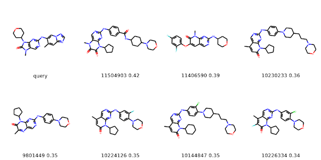

> **EDITED on 23.01.2020** John Mayfield pointed out that the way I had constructed the set of 10 million molecules wasn't reproducible. This update fixes that, but it also changes the results.

It's been a while since I did a post about the cartridge! This one is a little bit ranty, but hopefully it's still useful.

# Some background and disclaimers

I normally do performance testing on the cartridge using ChEMBL, but since
that's "only" around 1.7 million compounds I wanted to try something a bit
bigger. But how big? I don't see the point in shoving 100 million compounds (or
a billion) into PostgreSQL (there's a mini-rant explaining this at the bottom of
the post), so I went with 10 million. That's more than five times bigger than
ChEMBL, but it's still not unimaginable that you'd actually have a relational
schema with a molecule table this size that has data about most of those
molecules in separate tables (again, see the mini-rant).

My goal here is to get a sense for what kind of performance you can expect for
doing "normal" chemical queries using a local PostgreSQL instance without having
to spend time optimizing the database or hardware configuration. I generated all
the numbers below on my Linux desktop - which is 4-5 years old at this point -
using an out-of-the-box install of PostgreSQL 12 (the only configuration tuning
was to increase the size of shared_buffers to 4096M and work_mem as described in
the [RDKit docs](https://www.rdkit.org/docs/Cartridge.html)). I was also using
the machine for other things (like reading email or writing this post in Chrome)
while these queries ran, so the numbers are really just ballpark estimates.

So which molecules to use? Rather than agonizing overly much about this, I just
grabbed a [PubChem Compound SMILES
dump](ftp://ftp.ncbi.nlm.nih.gov/pubchem/Compound/Weekly/2020-01-05/Extras/) and
took the first 10 million molecules from that.

I hedged above by saying "normal" chemical queries. I have a longer rant about
that topic that I will spare you the details of, but I generally think that
including worst-case queries (i.e. things that return tens or hundreds of
thousands of rows) in real-world benchmarking examples is pointless. It's
definitely useful to understand the worst-case performance of a system, but
that's not what I'm doing here. So my queries will often limit the number of
rows returned to what I think is a "reasonable" number for interactive usage.

# Creating the database

This tends to be time consuming, particularly creating the molecule index.
Start by creating the database from the command line and loading all of the raw data:

```
glandrum@otter:/tmp/pubchem_load$ createdb pubchem_compound 
glandrum@otter:/tmp/pubchem_load$ psql -c 'create extension rdkit' pubchem_compound 
CREATE EXTENSION 
glandrum@otter:/tmp/pubchem_load$ psql -c 'create table raw_data (id SERIAL,cid integer, smiles text)' pubchem_compound  
CREATE TABLE 
glandrum@otter:/tmp/pubchem_load$ zcat CID-SMILES.gz | sed 's/\\/\\\\/g' | psql -c "copy raw_data (cid,smiles) from stdin with delimiter E'\t'" pubchem_compound  
COPY 102397130 
```

Now create the molecule table and build the index:

```
pubchem_compound=# alter table raw_data add primary key (cid); 
ALTER TABLE 
pubchem_compound=# \timing 
Timing is on. 
pubchem_compound=# select * into mols from (select cid,mol_from_smiles(smiles::cstring) m from raw_data order by cid limit 10000000) tmp where m is not null; 
... lots of info about failing molecules deleted here
WARNING:  could not create molecule from SMILES '[B+]12(CC3CC(C1)CC(C2)C3)NCC[O-]'
WARNING:  could not create molecule from SMILES '[B+]12(CC3CC(C1)CC(C2)C3)NCCO'
SELECT 9999165
Time: 1722464.775 ms (28:42.465)
pubchem_compound=# create index molidx on mols using gist(m);
CREATE INDEX
Time: 3735718.147 ms (01:02:15.718)
```

Add fingerprints and their index along with the primary keys we'll use to link things:

```
pubchem_compound=# create index fps_mfp2_idx on fps using gist(mfp2);
CREATE INDEX
Time: 155112.279 ms (02:35.112)
pubchem_compound=# alter table mols add primary key (cid); 
ALTER TABLE
Time: 44271.680 ms (00:44.272)
pubchem_compound=# alter table fps add primary key (cid);
ALTER TABLE
Time: 27675.441 ms (00:27.675)
```
Now let's do some queries.

# Substructure queries

Note that all of the results below are done with a "warm" disk cache: I ran a substructure search and similarity search to try and ensure that at least parts of the indices are being cached by the operating system.

Picking the queries for a demo is always tricky, and can obviously completely slant the results one way or another, so I went to the ASAP page for J Med Chem and pulled stuff from there.

Let's start with a query for parts of the "head" and "gate" from this paper: https://pubs.acs.org/doi/10.1021/acs.jmedchem.9b01912

```
pubchem_compound=# select * from mols where m@>'CC1=C(C=C(C=C1)C(N)=O)C#CC1=CN=CC=C1' limit 10;
   cid    |                                    m                                    
----------+-------------------------------------------------------------------------
 11526637 | Cc1ccc(C(=O)Nc2cc(OC[C@@H]3CCCN3C)cc(C(F)(F)F)c2)cc1C#Cc1cnc2nc[nH]c2c1
(1 row)

 Time: 5359.046 ms (00:05.359)
```

Here's the one hit:


Now the core from: https://pubs.acs.org/doi/10.1021/acs.jmedchem.9b01427

```
pubchem_compound=# select * from mols where m@>'CC1=CC2=C(S1)C(=O)NC(C)=N2' limit 10;   cid    |                         m                         
----------+---------------------------------------------------
  3758971 | CCOC(=O)C1CCCn2c1nc1cc(-c3ccccc3)sc1c2=O
 10622152 | COc1ccc(NC(=S)Nn2c(C)nc3cc(-c4ccccc4)sc3c2=O)cc1
  1040399 | COC(=O)[C@@H]1CCc2nc3cc(-c4ccc(OC)cc4)sc3c(=O)n21
  1040400 | COC(=O)[C@H]1CCc2nc3cc(-c4ccc(OC)cc4)sc3c(=O)n21
  3310123 | O=c1c2sc(-c3ccccc3)cc2nc2n1CCCCC2
  4376566 | CCOC(=O)C1CCCn2c1nc1cc(-c3ccc(OC)cc3)sc1c2=O
 10574247 | COc1ccccc1NC(=S)Nn1c(C)nc2cc(-c3ccccc3)sc2c1=O
 11404362 | Cc1cc2nc(-c3ccccc3)n(-c3ccccc3)c(=O)c2s1
 10716322 | Cc1cccc(NC(=S)Nn2c(C)nc3cc(-c4ccccc4)sc3c2=O)c1
   661611 | COc1ccc(-c2cc3nc4n(c(=O)c3s2)CCOC4)cc1
(10 rows)

Time: 6.532 ms
```

And the results:


And, finally, the core from: https://pubs.acs.org/doi/10.1021/acs.jmedchem.9b01684

```
pubchem_compound=# select * from mols where m@>'CN1C(=O)N(C)C2=C1C=NC(N)=N2' limit 10;
   cid    |                                        m                                        
----------+---------------------------------------------------------------------------------
 10359733 | C=CCn1c(=O)n(CCCCCCCC)c2nc(N)nc(Cl)c21
 10452174 | Nc1nc2c(c(=O)n1N)n(CCCl)c(=O)n2[C@@H]1O[C@H](CO)[C@@H](O)[C@H]1O
 10048317 | Nc1nc2c(c(=O)n1N)n(C/C=C/c1ccccc1)c(=O)n2[C@@H]1O[C@H](CO)[C@@H](O)[C@H]1O
 10454396 | [N-]=[N+]=NCC(O)Cn1c(=O)n([C@@H]2O[C@H](CO)[C@@H](O)[C@H]2O)c2nc(N)n(N)c(=O)c21
 10476329 | Nc1nc2c(c(=O)n1N)n(Cc1ccccc1)c(=O)n2[C@@H]1O[C@H](CO)[C@@H](O)[C@H]1O
 11428584 | C=CCn1c(=O)n([C@@H]2O[C@H](CO)[C@@H](O)[C@H]2O)c2nc(N)nc(OCC)c21
 11453816 | C=CCn1c(=O)n([C@@H]2O[C@H](CO)[C@@H](O)[C@H]2O)c2nc(N)nc(OCN(C)C(=O)OCC)c21
  9980347 | COc1ccc(Cn2c(=O)n([C@@H]3O[C@H](CO)[C@@H](O)[C@H]3O)c3nc(N)n(N)c(=O)c32)cc1
 10085856 | Cn1c(=O)n2c3c1c(=O)nc(N)n3C[C@H]1O[C@@H]2[C@H](O)[C@@H]1O
  9994808 | C=CCn1c(=O)n(CCCCO)c2nc(N)nc(Cl)c21
(10 rows)

Time: 107.934 ms
```

And the first results:


These queries are, in general, pretty quick. I'm certainly likely to spend more
time looking at the results than I am waiting for them to come back.

One point it's worth making is that queries that don't return any results tend
to be pretty fast. Here's an example of that:

```
pubchem_compound=# select * from mols where m@>'O1C=NC2=C1N=C1N=CN=CC1=N2' limit 5;
 cid | m 
-----+---
(0 rows)

Time: 9.778 ms
```

Note that this is definitely not always true... the index does not work
particularly well for queries that have massively repeating common
substructures:

```
pubchem_compound=# select * from mols where m@>'COCOCOCOCOCOCOCOCOCOCOCOCOCOCOCOCOCOCCOCOCOCOCOCCO' limit 5;
 cid | m 
-----+---
(0 rows)

Time: 150521.647 ms (02:30.522)
```

Remember what I said about about worst-case performance? There ya go.

# Similarity queries

Now let's do some similarity searches using the molecule drawn in the graphical
abstract as queries. For this blog post I'm going to use the cartridge's
"neighbor" operator <%> to order the results and allow the N closest neighbors
of each query molecule to be retrieved. Here's the simple SQL function that I
use for doing that:

```
pubchem_compound=# pubchem_compound=# create or replace function get_mfp2_neighbors2(smiles text) 
returns table(cid integer, m mol, similarity double precision) as 
$$ 
select cid,m,tanimoto_sml(morganbv_fp(mol_from_smiles($1::cstring)),mfp2) as similarity 
from fps join mols using (cid) 
order by morganbv_fp(mol_from_smiles($1::cstring))<%>mfp2; 
$$ language sql stable ;  
```

That's adapted from the function get_mfp2_neighbors that is in the [RDKit
cartridge documentation](https://www.rdkit.org/docs/Cartridge.html).

Let's start with a query for the five nearest neighbors of balovaptan
(https://pubs.acs.org/doi/10.1021/acs.jmedchem.9b01478):

```
pubchem_compound=# select * from get_mfp2_neighbors2('CN1CC2=NN=C(C3CCC(CC3)OC3=CC=CC=N3)N2C2=CC=C(Cl)C=C2C1') limit 5;
   cid    |                              m                              |     similarity     
----------+-------------------------------------------------------------+--------------------
 11237434 | CN1Cc2cc(Cl)ccc2-n2c(nnc2C2CCN(c3ccccn3)CC2)C1              | 0.7049180327868853
 11237433 | CN1Cc2cc(Cl)ccc2-n2c(nnc2C2CCN(c3ccccn3)CC2)C1.Cl.Cl.Cl     | 0.6935483870967742
 10070061 | CN1CCc2cc(Cl)ccc2-n2c(nnc2C2CCN(c3ccccn3)CC2)C1             | 0.6212121212121212
 11270862 | Cc1ccccc1CC(=O)N1CCC(c2nnc3n2-c2ccc(Cl)cc2CN(C)C3)CC1       | 0.5797101449275363
 11442570 | CN1Cc2cc(Cl)ccc2-n2c(nnc2C2CCN(C(=O)c3c[nH]c4ccccc34)CC2)C1 | 0.5774647887323944
(5 rows)

Time: 239.879 ms
```

It's easy (and quick) to expand that to the ten nearest neighbors:

```
pubchem_compound=# select * from get_mfp2_neighbors2('CN1CC2=NN=C(C3CCC(CC3)OC3=CC=CC=N3)N2C2=CC=C(Cl)C=C2C1') limit 10;
   cid    |                              m                              |     similarity     
----------+-------------------------------------------------------------+--------------------
 11237434 | CN1Cc2cc(Cl)ccc2-n2c(nnc2C2CCN(c3ccccn3)CC2)C1              | 0.7049180327868853
 11237433 | CN1Cc2cc(Cl)ccc2-n2c(nnc2C2CCN(c3ccccn3)CC2)C1.Cl.Cl.Cl     | 0.6935483870967742
 10070061 | CN1CCc2cc(Cl)ccc2-n2c(nnc2C2CCN(c3ccccn3)CC2)C1             | 0.6212121212121212
 11270862 | Cc1ccccc1CC(=O)N1CCC(c2nnc3n2-c2ccc(Cl)cc2CN(C)C3)CC1       | 0.5797101449275363
 11442570 | CN1Cc2cc(Cl)ccc2-n2c(nnc2C2CCN(C(=O)c3c[nH]c4ccccc34)CC2)C1 | 0.5774647887323944
 11486399 | CN1Cc2cc(Cl)ccc2-n2c(nnc2C2CCN(C(=O)CC3CC3)CC2)C1           | 0.5757575757575758
 11349733 | CCCC(=O)N1CCC(c2nnc3n2-c2ccc(Cl)cc2CN(C)C3)CC1              | 0.5757575757575758
 11305733 | CN1Cc2cc(Cl)ccc2-n2c(nnc2C2CCN(C(=O)c3cc4ccccc4[nH]3)CC2)C1 | 0.5694444444444444
 11166614 | CN1Cc2cc(Cl)ccc2-n2c(nnc2C2CCN(C(=O)C3(C)CCCCC3)CC2)C1      | 0.5671641791044776
 10028677 | CN1CCOC(CN2Cc3cc(Cl)ccc3-n3c(nnc3C3CCN(c4ccccn4)CC3)C2)C1   | 0.5616438356164384
(10 rows)

Time: 189.425 ms
```

Here are the first few of those, along with the similarity values:


The five nearest neighbors for AZD7648 (https://pubs.acs.org/doi/10.1021/acs.jmedchem.9b01684) aren't particularly similar:

```
pubchem_compound=# select * from get_mfp2_neighbors2('CN1C(=O)N(C2CCOCC2)C2=C1C=NC(NC1=CN3N=CN=C3C=C1C)=N2') limit 5;
   cid    |                                   m                                   |     similarity      
----------+-----------------------------------------------------------------------+---------------------
 11504903 | Cn1c(=O)c(=O)n(C2CCCC2)c2nc(Nc3ccc(C(=O)NC4CCC(N5CCOCC5)CC4)cc3)ncc21 |  0.4166666666666667
 11406590 | Cn1c(=O)c(Oc2ccc(F)cc2F)cc2cnc(NC3CCOCC3)nc21                         |  0.3924050632911392
 10230233 | Cc1cc(=O)n(C2CCCC2)c2nc(Nc3ccc(N4CCC(CCCN5CCOCC5)CC4)cc3)ncc12        |  0.3595505617977528
  9801449 | Cc1nc2cnc(Nc3ccc(N4CCOCC4)cc3)nc2n(C2CCCC2)c1=O                       | 0.35443037974683544
 10224126 | Cc1cc(=O)n(C2CCCC2)c2nc(Nc3ccc(N4CCOCC4)c(F)c3)ncc12                  |  0.3488372093023256
(5 rows)

Time: 219.653 ms
```

As we can see:



The performance of these queries isn't quite as good as what you can do with
specialized open-source tools like chemfp, gpusimilarity, or FPSim2, but I think
it's reasonable for retrieving a set of neighbors that I'm then going to do
(probably more time consuming) further analysis on.

**Note** that the similarity queries were considerably slower in the original
version of this blog post. This was likely due to me doing a bad job of warming
up the disk cache.

# Some technical details:

## Sizes of the tables and indices
```
pubchem_compound=# \d+
                             List of relations
 Schema |      Name       |   Type   |  Owner   |    Size    | Description 
--------+-----------------+----------+----------+------------+-------------
 public | fps             | table    | glandrum | 964 MB     | 
 public | mols            | table    | glandrum | 4236 MB    | 
 public | raw_data        | table    | glandrum | 9091 MB    | 
 public | raw_data_id_seq | sequence | glandrum | 8192 bytes | 
(4 rows)
pubchem_compound=# \di+
                              List of relations
 Schema |     Name      | Type  |  Owner   |  Table   |  Size   | Description 
--------+---------------+-------+----------+----------+---------+-------------
 public | fps_mfp2_idx  | index | glandrum | fps      | 1226 MB | 
 public | fps_pkey      | index | glandrum | fps      | 214 MB  | 
 public | molidx        | index | glandrum | mols     | 4060 MB | 
 public | mols_pkey     | index | glandrum | mols     | 214 MB  | 
 public | raw_data_pkey | index | glandrum | raw_data | 2193 MB | 
(5 rows)
```

## Performance of the substructure indices
Here are results for the substructure queries executed above. For the purposes
of this analysis I removed the limit on the query:

```
pubchem_compound=# explain analyze select * from mols where m@>'CC1=C(C=C(C=C1)C(N)=O)C#CC1=CN=CC=C1';
                                                        QUERY PLAN                                                         
---------------------------------------------------------------------------------------------------------------------------
 Bitmap Heap Scan on mols  (cost=2157.91..37897.03 rows=9999 width=398) (actual time=167.546..168.902 rows=1 loops=1)
   Recheck Cond: (m @> 'Cc1ccc(C(N)=O)cc1C#Cc1cccnc1'::mol)
   Rows Removed by Index Recheck: 328
   Heap Blocks: exact=309
   ->  Bitmap Index Scan on molidx  (cost=0.00..2155.41 rows=9999 width=0) (actual time=137.703..137.703 rows=329 loops=1)
         Index Cond: (m @> 'Cc1ccc(C(N)=O)cc1C#Cc1cccnc1'::mol)
 Planning Time: 0.119 ms
 Execution Time: 169.178 ms
(8 rows)

pubchem_compound=# explain analyze select * from mols where m@>'CC1=CC2=C(S1)C(=O)NC(C)=N2';
                                                        QUERY PLAN                                                        
--------------------------------------------------------------------------------------------------------------------------
 Bitmap Heap Scan on mols  (cost=2157.91..37897.03 rows=9999 width=398) (actual time=436.998..510.558 rows=46 loops=1)
   Recheck Cond: (m @> 'Cc1nc2cc(C)sc2c(=O)[nH]1'::mol)
   Rows Removed by Index Recheck: 14
   Heap Blocks: exact=55
   ->  Bitmap Index Scan on molidx  (cost=0.00..2155.41 rows=9999 width=0) (actual time=436.902..436.902 rows=60 loops=1)
         Index Cond: (m @> 'Cc1nc2cc(C)sc2c(=O)[nH]1'::mol)
 Planning Time: 0.113 ms
 Execution Time: 510.801 ms
(8 rows)


pubchem_compound=# explain analyze select * from mols where m@>'CN1C(=O)N(C)C2=C1C=NC(N)=N2';
                                                         QUERY PLAN                                                         
----------------------------------------------------------------------------------------------------------------------------
 Bitmap Heap Scan on mols  (cost=2157.91..37897.03 rows=9999 width=398) (actual time=5111.590..5113.136 rows=38 loops=1)
   Recheck Cond: (m @> 'Cn1c(=O)n(C)c2nc(N)ncc21'::mol)
   Rows Removed by Index Recheck: 10
   Heap Blocks: exact=48
   ->  Bitmap Index Scan on molidx  (cost=0.00..2155.41 rows=9999 width=0) (actual time=5081.767..5081.768 rows=48 loops=1)
         Index Cond: (m @> 'Cn1c(=O)n(C)c2nc(N)ncc21'::mol)
 Planning Time: 0.058 ms
 Execution Time: 5113.296 ms
(8 rows)
```

All of those show that the index is doing a reasonably good job of pruning
compounds - the worst case query (the first one) only ends up trying at 329
substructure queries (instead of 10 million!) to find the 1 actual match.

## Warming up the disk cache

There are tons of ways to do this. Here's the approach I used for this post:
```
pubchem_compound=# select cid,mol_murckoscaffold(m) scaff into temporary table scaffs from mols order by cid desc limit 10;
SELECT 10
pubchem_compound=# select count(*) from mols cross join scaffs where mols.m@>scaffs.scaff;
 count  
--------
 178828
(1 row)
pubchem_compound=# select * into blah from fps order by cid desc limit 10;
SELECT 10
pubchem_compound=# select count(*) from fps cross join blah where blah.mfp2%fps.mfp2;
 count 
-------
   401
(1 row)
```

That takes ~10 minutes to run for me.

## Doing the queries and making the images
Since I'm not doing this one from a jupyter notebook, here's the code snippet
I'm using in jupyter to do the substructure queries and display the results:

```
q='CN1C(=O)N(C)C2=C1C=NC(N)=N2'
t1=time.time()
d = %sql postgresql://localhost/pubchem_compound select * from mols where m@>:q limit 10;
t2 = time.time()
print(f'{t2-t1:.2f} seconds')
ms = [Chem.MolFromSmiles(x) for x in [q]+[x[1] for x in d]]
ls = ['query']+[str(x[0]) for x in d]
Draw.MolsToGridImage(ms[:8],legends=ls,molsPerRow=4)
```

And the equivalent thing for nearest-neighbor queries:

```
q='CN1CC2=NN=C(C3CCC(CC3)OC3=CC=CC=N3)N2C2=CC=C(Cl)C=C2C1'
t1=time.time()
d = %sql postgresql://localhost/pubchem_compound select * from get_mfp2_neighbors2(:q) limit 10;
t2 = time.time()
print(f'{t2-t1:.2f} seconds')
ms = [Chem.MolFromSmiles(x) for x in [q]+[x[1] for x in d]]
ls = ['query']+[f'{x[0]} {x[2] :.2f}' for x in d]
Draw.MolsToGridImage(ms[:8],legends=ls,molsPerRow=4)
```

Both of these are using the fantastic
[sql-magic](https://github.com/catherinedevlin/ipython-sql) for jupyter from
Catherine Devlin.

# Mini-rant

PostgreSQL is a general purpose relational database, it lets you store
collections of tables with links (relations) between them and makes it easy to
do queries that combine data across tables. If you have data on a bunch of
molecules that can't be logically captured in a single table (like ChEMBL!), a
relational database is a great place to put that. If you have a single table
with a bunch of columns (i.e. molecules and values or fingerprints computed from
them), you may want to look to another type of system. If you have a huge number
of rows that you are really only interested in doing chemical queries
(substructure and similarity searches) against, and you care about performance,
then you almost certainly should be using a specialized system. There are plenty
to choose from!
